# Module 2.2 Workflow Diagram Example

This is what Cursor will display in chat at the beginning of Module 2.2 to show students the complete data-driven PM workflow.

## Mermaid Diagram Code

```mermaid
graph TD
    A[Start: Module 2.2 Data Analysis] --> B[File Orientation]
    B --> B1[Explain CSV files<br/>what each dataset contains]

    B1 --> C[Phase 1: DISCOVERY]
    C --> C1[Analyze activation-funnel-q4.csv]
    C1 --> C2[Find: 60% drop-off between<br/>task creation → completion]
    C2 --> C3{Interactive Choice:<br/>What's causing the drop?}
    C3 --> C4[Analyze user-survey-responses.csv]
    C4 --> C5[800 responses: users overwhelmed,<br/>need examples]
    C5 --> C6{Interactive Choice:<br/>What should we build?}
    C6 --> C7[📄 Create activation-problem-analysis.md]

    C7 --> D[Phase 2: IMPACT ESTIMATION]
    D --> D1[Learn impact-estimation-framework.md<br/>Users × Rate × Lift × Value]
    D1 --> D2[Analyze taskflow-usage-data-q4.csv<br/>to build ROI model]
    D2 --> D3[📄 Create guided-onboarding-roi-scenarios.md<br/>Pessimistic, Realistic, Optimistic]
    D3 --> D4{Interactive Choice:<br/>Pitch to leadership?}

    D4 --> E[Phase 3: EXPERIMENT ANALYSIS]
    E --> E1[Analyze onboarding-experiment-results.csv<br/>8,000 users: 4k treatment, 4k control]
    E1 --> E2[Topline: 45% → 48%, p=0.04<br/>Looks disappointing 😬]
    E2 --> E3{🎭 DRAMATIC MOMENT<br/>Interactive Choice:<br/>Ship, iterate, or kill?}

    E3 --> E4[REVEAL: Segment by company size!]
    E4 --> E5[Small teams: +11.4pp ✅<br/>Enterprise: -3.5pp ❌]
    E5 --> E6{Interactive Choice:<br/>Ship to everyone or just small teams?}

    E6 --> E7[Analyze quality metrics:<br/>Retention 60% → 78%<br/>Tasks completed 2.9 → 6.8]
    E7 --> E8[Analyze leading indicators:<br/>Template usage 3.2x<br/>Invite rate 2.9x]
    E8 --> E9[📄 Create onboarding-experiment-readout.md]

    E9 --> F[✅ Complete Data-Driven PM Workflow]

    style A fill:#4A90E2,stroke:#2E5C8A,stroke-width:2px,color:#fff
    style C fill:#F5A623,stroke:#C17D11,stroke-width:2px,color:#fff
    style C7 fill:#7ED321,stroke:#5FA319,stroke-width:2px,color:#fff
    style D fill:#F5A623,stroke:#C17D11,stroke-width:2px,color:#fff
    style D3 fill:#7ED321,stroke:#5FA319,stroke-width:2px,color:#fff
    style E fill:#F5A623,stroke:#C17D11,stroke-width:2px,color:#fff
    style E3 fill:#E74C3C,stroke:#C0392B,stroke-width:3px,color:#fff
    style E4 fill:#F39C12,stroke:#D68910,stroke-width:3px,color:#000
    style E9 fill:#7ED321,stroke:#5FA319,stroke-width:2px,color:#fff
    style F fill:#50C878,stroke:#2D7A4A,stroke-width:3px,color:#fff
```

## Key Teaching Moments

### 1. CSV File Orientation
Set expectations upfront: "These won't render in Cursor, but I'll read them and show you formatted results"

### 2. Interactive Hypothesis Testing
After showing funnel drop-off, ask students to hypothesize BEFORE revealing survey data. This teaches data-driven thinking.

### 3. The Dramatic Reveal (Phase 3)
- First show disappointing topline → ask for decision
- THEN reveal segmentation showing huge win
- This teaches: never stop at topline metrics!

### 4. Document Creation Moments
Three key documents created:
1. Problem analysis (Phase 1)
2. ROI scenarios (Phase 2)
3. Experiment readout (Phase 3)

Each shows how to synthesize data into decision-ready documents.
