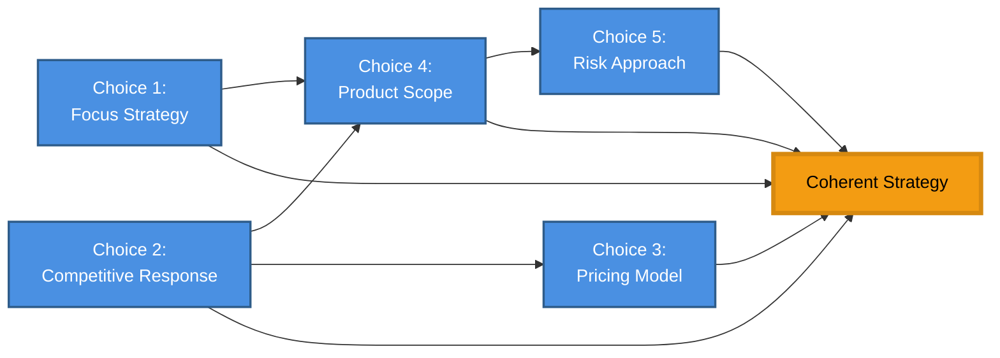

# Module 2.3 Workflow Diagram Example

This is what Cursor will display in chat at the beginning of Module 2.3 to show students the complete strategy development workflow.

## Mermaid Diagram Code

```mermaid
graph TD
    A[Start: Module 2.3 Product Strategy] --> B[File Orientation]
    B --> B1[Walk through frameworks folder:<br/>Rumelt, Gibson Biddle, SWOT]
    B1 --> B2[Preview: 5 strategic choices ahead]

    B2 --> C[Phase 1: Learn Framework]
    C --> C1[Rumelt's Strategy Kernel:<br/>Diagnosis → Guiding Policy → Coherent Actions]

    C1 --> D[Phase 2: Gather Intelligence]
    D --> D1[Review strategic situation<br/>2 engineers, $50k budget, moderate usage]
    D1 --> D2[Web search: Notion AI features & pricing]
    D1 --> D3[Web search: Linear AI strategy]
    D1 --> D4[Web search: Asana AI capabilities]
    D2 & D3 & D4 --> D5[Synthesize competitive landscape]

    D5 --> E[Phase 3: Make Strategic Choices]
    E --> E1[Choice 1: Focus vs Breadth<br/>A, B, or C?]
    E1 --> E2[😈 Devil's Advocate Challenge]
    E2 --> E3[Stick or Reconsider?]

    E3 --> E4[Choice 2: Competitive Response<br/>A, B, or C?]
    E4 --> E5[😈 Devil's Advocate Challenge]
    E5 --> E6[Stick or Reconsider?]

    E6 --> E7[Choice 3: AI Pricing<br/>A, B, or C?]
    E7 --> E8[😈 Devil's Advocate Challenge]
    E8 --> E9[Stick or Reconsider?]

    E9 --> E10[Choice 4: Product Scope<br/>A, B, or C?]
    E10 --> E11[😈 Devil's Advocate Challenge]
    E11 --> E12[Stick or Reconsider?]

    E12 --> E13[Choice 5: Risk Tolerance<br/>A, B, or C?]
    E13 --> E14[😈 Devil's Advocate Challenge]
    E14 --> E15[Stick or Reconsider?]

    E15 --> F[Phase 4: Synthesize Strategy]
    F --> F1[📄 Create h1-2026-ai-product-strategy.md<br/>Using Rumelt's framework]
    F1 --> F2[Show Mermaid diagram:<br/>How 5 choices connect & reinforce]

    F2 --> G[Phase 5: Create Presentation]
    G --> G1[📄 Create strategy-review-slides.md<br/>12-15 slides with embedded diagrams]
    G1 --> G2[Title, Exec Summary, Diagnosis,<br/>Competitive Landscape, Strategic Direction,<br/>Tradeoffs, Q1/Q2 Roadmap, Metrics,<br/>Assumptions, Why We'll Win, Risks, The Ask]

    G2 --> H[✅ Complete AI Product Strategy]

    style A fill:#4A90E2,stroke:#2E5C8A,stroke-width:2px,color:#fff
    style C fill:#F5A623,stroke:#C17D11,stroke-width:2px,color:#fff
    style D fill:#F5A623,stroke:#C17D11,stroke-width:2px,color:#fff
    style D5 fill:#7ED321,stroke:#5FA319,stroke-width:2px,color:#fff
    style E fill:#F5A623,stroke:#C17D11,stroke-width:2px,color:#fff
    style E2 fill:#E74C3C,stroke:#C0392B,stroke-width:2px,color:#fff
    style E5 fill:#E74C3C,stroke:#C0392B,stroke-width:2px,color:#fff
    style E8 fill:#E74C3C,stroke:#C0392B,stroke-width:2px,color:#fff
    style E11 fill:#E74C3C,stroke:#C0392B,stroke-width:2px,color:#fff
    style E14 fill:#E74C3C,stroke:#C0392B,stroke-width:2px,color:#fff
    style F fill:#F5A623,stroke:#C17D11,stroke-width:2px,color:#fff
    style F1 fill:#7ED321,stroke:#5FA319,stroke-width:2px,color:#fff
    style F2 fill:#F39C12,stroke:#D68910,stroke-width:3px,color:#000
    style G fill:#F5A623,stroke:#C17D11,stroke-width:2px,color:#fff
    style G1 fill:#7ED321,stroke:#5FA319,stroke-width:2px,color:#fff
    style H fill:#50C878,stroke:#2D7A4A,stroke-width:3px,color:#fff
```

## Strategy Choice Connection Diagram

After Phase 4, show students how their 5 choices connect:

This shows students that their choices weren't isolated - they reinforce each other to create a coherent strategy.

## Key Teaching Moments

### 1. Framework Orientation
Walk through each framework file, explain what it does, which one we'll use today (Rumelt), and which are optional advanced tools.

### 2. Preview the Journey
Show all 5 choice topics upfront so students aren't surprised. They know what's coming and can think ahead.

### 3. Devil's Advocate Pattern
After EVERY choice, challenge it hard. This teaches strategic thinking - every choice has tradeoffs.

### 4. Visual Strategy Synthesis
Use Mermaid to show how the 5 choices connect. Makes abstract strategy concrete and memorable.

### 5. Executive-Ready Output
The final slides document is something they could actually present to leadership. Shows real-world application.
