# Module 2.2: Analyze Data - Teaching Script

- Welcome to Module 2.2: Analyze Data!
- This module teaches you how to use Cursor for the complete data-driven PM workflow: Discovery → Impact Estimation → Experiment Analysis
- You're going to learn how Cursor makes data analysis 10x faster than spreadsheets
- Here's what normally takes 4-6 hours in Excel: you'll do it in 30 minutes with Cursor
- The scenario: You're the Senior PM for Activation at TaskFlow
- Your activation rate has been stuck at 45% for 6 months and leadership is asking what you're going to do about it
- STOP: Ready to use Cursor to figure out what's wrong?
- USER: Confirms ready

---

- Let me show you the complete workflow we'll follow
- ACTION: Display this Mermaid diagram:

```mermaid
graph TD
    subgraph P1["🔍 Phase 1: Discovery"]
        D1["Find the problem<br/>• Analyze funnel data<br/>• Extract survey themes<br/>• Identify drop-off points"]
    end

    subgraph P2["💰 Phase 2: Impact Estimation"]
        D2["Build the business case<br/>• Create ROI model<br/>• 3 scenarios (pessimistic/realistic/optimistic)<br/>• Secure leadership buy-in"]
    end

    subgraph P3["📊 Phase 3: Experiment Analysis"]
        D3["Analyze the results<br/>• Review topline metrics<br/>• Segment by user type<br/>• Check quality & leading indicators"]
    end

    P1 ==> P2
    P2 ==> P3

    style P1 fill:#e3f2fd,stroke:#1976d2,stroke-width:3px,color:#000
    style P2 fill:#fff3e0,stroke:#f57c00,stroke-width:3px,color:#000
    style P3 fill:#e8f5e9,stroke:#388e3c,stroke-width:3px,color:#000
    style D1 fill:#fff,stroke:#1976d2,stroke-width:2px,color:#000
    style D2 fill:#fff,stroke:#f57c00,stroke-width:2px,color:#000
    style D3 fill:#fff,stroke:#388e3c,stroke-width:2px,color:#000
```

- This is how great PMs work: discover with data, estimate impact, build, analyze results, iterate
- STOP: Do you see the workflow diagram showing all 3 phases?
- USER: Confirms

---

- Perfect! Now let me explain the data files we'll be using
- I have 4 CSV files with real data from TaskFlow
- Important note about CSVs: They won't render nicely in Cursor like markdown files
	- Cursor can't preview CSV files visually
	- But here's the magic: Cursor can read them and present the data in formatted tables for you
	- No need to open Excel or build formulas - just ask Cursor to analyze the data
	- If you want to see the raw data yourself, you can open them in Excel, Google Sheets, or VS Code
- Here's what each dataset contains:
	- activation-funnel-q4.csv: User journey data through signup → first task created → first task completed → invite sent
	- user-survey-responses.csv: 800 survey responses about onboarding confusion and feature requests
	- taskflow-usage-data-q4.csv: Product usage patterns (signups, conversion rates, time-to-value)
	- onboarding-experiment-results.csv: A/B test data from 8,000 users testing guided onboarding
- STOP: Make sense how we'll work with these CSV files?
- USER: Confirms

---

- Great! Let's dive into Phase 1: Discovery
- First question: WHERE are users getting stuck in the activation funnel?
- Let's ask Cursor to analyze the funnel data to find the drop-off points
- STOP: Ask me: "@ mention activation-funnel-q4.csv and analyze it to find where users are dropping off in the activation flow"
- USER: @ mention activation-funnel-q4.csv and analyze it to find where users are dropping off in the activation flow

---

- ACTION: Read activation-funnel-q4.csv and calculate drop-off rates
- Done! I've analyzed the funnel data
- Here's what I found (showing as a formatted table):

| Funnel Step | Users | Completion Rate |
|-------------|-------|-----------------|
| Signup | 10,000 | 100% |
| First Task Created | 7,200 | 72% |
| First Task Completed | 2,880 | 40% ← BIG DROP |
| Invite Sent | 1,440 | 50% |

- Found the problem! 60% of users who create a task never complete it
- Almost 3 out of 4 users create a task, but then 6 out of 10 abandon it before marking it complete
- Notice what just happened: Cursor analyzed 10,000 rows of funnel data in seconds
- No formulas, no pivot tables - just ask for the analysis you need and Cursor delivers it
- STOP: Why do you think users are abandoning tasks they just created? A) Confusion/overwhelmed by interface, B) Too much friction in the flow, C) Missing key features, D) Technical issues
- USER: Chooses A, B, C, or D

---

- ACTION: Store user's choice in memory for personalized response
- [If A] Good instinct - let's see if the data supports that confusion is the culprit
- [If B] Interesting theory - let's validate if friction is the real issue
- [If C] Could be - let's check what users are asking for
- [If D] Let's see if technical issues show up in the data
- Now let's validate your hypothesis with user research
- We have survey data from 800 recent signups who answered questions about onboarding confusion
- STOP: Ask me: "@ mention user-survey-responses.csv and analyze it to extract the top themes explaining why users drop off at task completion"
- USER: @ mention user-survey-responses.csv and analyze it to extract the top themes explaining why users drop off at task completion

---

- ACTION: Read user-survey-responses.csv and extract themes from confusion/request fields
- Done! I've analyzed all 800 survey responses
- Here's what the data reveals:
	- Top complaint #1: "Didn't know what to create" (35% of responses - 280 users)
	- Top complaint #2: "Needed examples or templates" (28% of responses - 224 users)
	- Top complaint #3: "Felt overwhelmed by blank canvas" (22% of responses - 176 users)
	- Top complaint #4: "Unclear what tasks should look like" (15% of responses - 120 users)
- Powerful user quotes:
	- "I signed up but stared at the empty project for 5 minutes not knowing what to do"
	- "Wish there were example tasks so I could see what a good task looks like"
	- "Coming from Asana, I expected some starter templates"
- Key insight: Small teams (5-20 people) mentioned this 2x more often than enterprise users
- ACTION: If user chose A earlier, say: "Your hypothesis was right - confusion and overwhelm is the issue!"
- See how easy that was? Cursor just analyzed 800 survey responses and extracted themes in seconds
- With traditional tools, you'd be manually reading surveys and tallying responses for hours
- STOP: Based on this data, what feature should we build? A) Task templates library, B) Sample project pre-populated with example tasks, C) Video tutorial walkthrough, D) Simplified task creation interface
- USER: Chooses A, B, C, or D

---

- [Acknowledge their choice briefly]
- For this module, we're going to move forward with option B: Guided Onboarding with a sample project
- The concept: When new users sign up, show them a pre-populated sample project with 5-6 example tasks
- Each task demonstrates what good looks like: clear title, detailed description, assigned owner, due date
- Users complete these samples to learn the system, then create their own project
- Now let's document our discovery findings
- STOP: Ask me: "Create activation-problem-analysis.md that synthesizes the funnel data, survey insights, and proposed guided onboarding solution"
- USER: Create activation-problem-analysis.md that synthesizes the funnel data, survey insights, and proposed guided onboarding solution

---

- ACTION: Create activation-problem-analysis.md with this structure:
	- Problem Statement: 60% drop-off between task creation and completion
	- Quantitative Evidence: Funnel data showing the drop-off point
	- Qualitative Evidence: Survey quotes and top 4 themes
	- Segmentation Insight: Especially bad for small teams (our target market!)
	- Proposed Solution: Guided Onboarding with sample project
	- Expected Outcome: Reduce drop-off by making task creation less intimidating
- Done! I've created a comprehensive problem analysis document
- Cursor just synthesized funnel data + survey insights into a polished executive-ready document
- Normally this synthesis and writing takes an hour - Cursor did it in seconds
- STOP: Open activation-problem-analysis.md - do you see the complete discovery findings?
- USER: Confirms

---

- Excellent! Phase 1 Discovery is complete ✓
- We've identified the problem (60% drop-off) and proposed a solution (guided onboarding)
- Now comes Phase 2: Impact Estimation
- Before we commit 4 months of engineering time, we need to answer: What's the business impact?
- Leadership wants to see: How much will activation improve? What's the revenue impact? What's the ROI?
- I have an impact estimation framework in impact-estimation-framework.md
- It uses the formula: Impact = Users Affected × Current Rate × Expected Lift × Value per Action
- The framework helps you build three scenarios (pessimistic, realistic, optimistic) to show the range of outcomes
- STOP: Ask me: "@ mention impact-estimation-framework.md and explain how to use it for this guided onboarding feature"
- USER: @ mention impact-estimation-framework.md and explain how to use it for this guided onboarding feature

---

- ACTION: Read impact-estimation-framework.md and explain the framework
- ACTION: Explain how to apply it to guided onboarding:
	- Users Affected: New signups each month (with adoption rate assumptions)
	- Current Rate: 45% activation baseline
	- Expected Lift: How much will guided onboarding improve activation?
	- Value per Action: LTV of an activated user
- The key is modeling three scenarios to show the range of outcomes
- Now let's build the impact model for guided onboarding using the framework
- We'll ask Cursor to analyze your usage data and build the ROI projection with three scenarios
- STOP: Ask me: "@ mention taskflow-usage-data-q4.csv and impact-estimation-framework.md and build three ROI scenarios (pessimistic, realistic, optimistic) for the guided onboarding feature"
- USER: @ mention taskflow-usage-data-q4.csv and impact-estimation-framework.md and build three ROI scenarios (pessimistic, realistic, optimistic) for the guided onboarding feature

---

- ACTION: Read taskflow-usage-data-q4.csv and analyze signups, conversion rates, LTV
- ACTION: Create guided-onboarding-roi-scenarios.md with this structure:

**Pessimistic Scenario (20th percentile):**
- 30% adoption of guided onboarding
- 45% → 50% activation (+5pp lift)
- 105 additional activated users/month
- $9k additional monthly revenue
- $324k revenue over 3 years
- Investment: $100k engineering time
- ROI: 3.2x

**Realistic Scenario (50th percentile):**
- 70% adoption of guided onboarding
- 45% → 58% activation (+13pp lift)
- 455 additional activated users/month
- $39k additional monthly revenue
- $1.4M revenue over 3 years
- Investment: $100k engineering time
- ROI: 14x

**Optimistic Scenario (80th percentile):**
- 90% adoption of guided onboarding
- 45% → 62% activation (+17pp lift)
- 850 additional activated users/month
- $73k additional monthly revenue
- $2.6M revenue over 3 years
- Investment: $100k engineering time
- ROI: 26x

**Key Assumptions:**
- 350 new signups/month (historical average)
- Average LTV per activated user: $850
- Activated users stay 2.5x longer than non-activated users
- Engineering investment: 4 months, 2 engineers, $100k fully loaded cost

- Done! I've created the three-scenario impact model
- Cursor just built a complete ROI model with usage data, conversion rates, and LTV calculations
- Building this model manually in Excel typically takes a full day to build and validate
- Here's what it shows:
	- Even in the pessimistic case: 3.2x ROI over 3 years
	- Realistic case: 14x ROI over 3 years
	- Optimistic case: 26x ROI
- Plus strategic value: Can't scale if activation stays at 45%
- The investment is $100k in engineering time (4 months, 2 engineers)
- STOP: Would you pitch this to leadership and ask for approval? A) Yes, strong ROI even in pessimistic case, B) Need more data to be confident, C) ROI too uncertain to commit
- USER: Chooses A, B, or C

---

- [If A] Great instincts - most leadership teams would green-light this given the ROI
- [If B] Fair concern - but at some point you have to make a call with incomplete data
- [If C] Understandable caution, but the pessimistic case still shows 3.2x ROI
- In the real world, leadership would likely approve this
- Strong ROI even in pessimistic case, strategic importance, relatively small investment
- So let's say they approve it! Your team builds Guided Onboarding over 4 weeks
- You launch it as an A/B test: 4,000 users in treatment (with guided onboarding), 4,000 users in control (current experience)
- The experiment runs for 4 weeks and now results are in
- Phase 2 Impact Estimation is complete ✓
- Now for Phase 3: Experiment Analysis - the moment of truth
- STOP: Ready to analyze the results?
- USER: Confirms

---

- Let me show you the experiment data structure first
- ACTION: Display sample rows from onboarding-experiment-results.csv as a formatted table (first 5 rows)
- The dataset has 8,000 rows (4,000 control, 4,000 treatment) with these columns:
	- user_id, cohort (control/treatment), company_size (5-20, 21-99, 100+)
	- completed_first_task (TRUE/FALSE - our primary metric)
	- time_to_first_task_minutes, invited_teammate (TRUE/FALSE)
	- days_active_week_1, tasks_completed_week_1
- We'll look at primary metric first, then segment, then quality metrics
- STOP: Ask me: "@ mention onboarding-experiment-results.csv and analyze it to compare control vs treatment activation rates with statistical significance"
- USER: @ mention onboarding-experiment-results.csv and analyze it to compare control vs treatment activation rates with statistical significance

---

- ACTION: Read onboarding-experiment-results.csv and calculate topline activation rates
- Done! Here are the topline results:

| Cohort | Activated | Total | Rate | Lift |
|--------|-----------|-------|------|------|
| Control | 1,808 | 4,000 | 45.2% | - |
| Treatment | 1,912 | 4,000 | 47.8% | +2.6pp |

- Statistical significance: p = 0.04 (barely significant at p < 0.05)
- 95% Confidence Interval: [0.1%, 5.1%]
- Hmm... this looks underwhelming
- We projected 58% activation but only got 48%
- The lift is statistically significant but barely, and the confidence interval is wide
- This is pretty far from our realistic scenario estimate of 13 percentage points
- STOP: Based on these topline results, what's your call? A) Ship it anyway - any lift is good, B) Iterate more to improve the feature, C) Kill it - not worth the investment
- USER: Chooses A, B, or C

---

- ACTION: Store user's choice for personalized response
- [If A] Interesting - you're willing to ship despite disappointing topline
- [If B] Understandable - the results don't match projections
- [If C] Hold on - don't give up yet!
- Here's where Cursor really shines: when topline looks disappointing, it's effortless to dig deeper
- With Excel, segmenting data means rebuilding pivot tables and formulas - takes 20-30 minutes
- With Cursor, it's just one more command and you get instant answers
- The best part: iteration is free - not satisfied with one view? Ask for another
- We haven't segmented the data yet - remember, our target market is small teams (5-20 people), not enterprise
- What if the feature works great for small teams but poorly for enterprise?
- The topline would look modest, but we'd actually have a huge win for our target segment
- Let's ask Cursor to segment the data by company size
- STOP: Ask me: "Segment the experiment results by company size to see if small teams (our target market) had different outcomes than enterprise"
- USER: Segment the experiment results by company size to see if small teams (our target market) had different outcomes than enterprise

---

- ACTION: Read experiment data and calculate activation by company_size segment
- Done! Here's what segmentation reveals - this changes EVERYTHING:

**Small Teams (5-20 people) ← Our target market!**
- Control: 44.8% activation (1,075/2,400)
- Treatment: 56.2% activation (1,349/2,400)
- Lift: +11.4 percentage points
- p < 0.001 (highly significant!) ✓

**Mid-size Teams (21-99 people):**
- Control: 45.5% activation
- Treatment: 47.1% activation
- Lift: +1.6 percentage points (not significant)

**Enterprise (100+ people):**
- Control: 45.6% activation
- Treatment: 42.1% activation
- Lift: -3.5 percentage points (actually HURT activation!)
- p = 0.08 (borderline significant negative effect)

- AHA! This completely changes the story!
- For small teams, we saw +11.4pp lift (close to our 13pp estimate!) - highly significant
- For enterprise, it actually hurt activation by -3.5pp
- The modest topline was masking a huge win for our target market!
- One command and Cursor segmented 8,000 rows by company size - that would take 20+ minutes in Excel
- This is the power of Cursor: making it effortless to dig deeper when something looks off
- STOP: Does this change your recommendation? A) Ship to everyone anyway, B) Ship to small teams only (5-20 people), C) Still kill it, D) Iterate for enterprise too
- USER: Chooses A, B, C, or D

---

- [If B - correct answer] Exactly right! Ship to small teams, exclude enterprise
- [If A] Think about it - why ship something that hurts enterprise activation?
- [If C] Wait - we have a huge win for small teams! Why kill it?
- [If D] We could, but that's additional investment - better to ship the win we have
- Great thinking! But let's check one more thing: Quality over quantity
- Did we activate MORE users, or BETTER users?
- What if treatment users activate but then churn immediately?
- Let's ask Cursor to analyze Week 1 retention and engagement among activated users
- STOP: Ask me: "Filter to activated users only and compare Week 1 retention and task completion between control and treatment"
- USER: Filter to activated users only and compare Week 1 retention and task completion between control and treatment

---

- ACTION: Filter to activated users only and calculate Week 1 retention metrics
- Done! Here's the quality analysis:

| Cohort | Week 1 Retention (3+ days active) | Avg Tasks Completed |
|--------|-----------------------------------|---------------------|
| Control | 60.1% | 2.9 |
| Treatment | 78.4% | 6.8 |
| Lift | +18.3pp | 2.3x |

- Statistical significance: p < 0.001 (highly significant!)
- Wow! This is huge!
- Not only did we activate more users (especially small teams), but those activations were MUCH higher quality:
	- 78% retention vs 60% (+18pp)
	- 6.8 tasks vs 2.9 tasks (2.3x more engaged)
- This means higher retention and higher LTV - our revenue projections were actually CONSERVATIVE
- Notice: Cursor filtered to activated users only and recalculated everything instantly
- With traditional tools, each new cut of the data means rebuilding your analysis from scratch
- STOP: Do you see the quality metrics?
- USER: Confirms

---

- Perfect! One more thing: leading indicators
- These are metrics that predict long-term success
- Let's ask Cursor to analyze template usage and invite rate
- ACTION: Calculate template usage and invite rates from experiment data
- Done! Here are the leading indicators:

**Template Usage:**
- Control: 10.9% used templates
- Treatment: 35.2% used templates
- Lift: 3.2x higher (p < 0.001)
- Users who used templates completed 4.1x more tasks in Week 1

**Invite Teammate During Onboarding:**
- Control: 12.1% invited teammates
- Treatment: 34.8% invited teammates
- Lift: 2.9x higher (p < 0.001)
- Historical data shows users who invite teammates have 2.8x higher 30-day retention

- These are fantastic signals!
- Template usage shows the feature is sticky
- Invite rate predicts viral growth and retention
- Now let's create the experiment readout document
- STOP: Ask me: "Create onboarding-experiment-readout.md with the complete analysis: topline, segmentation, quality metrics, leading indicators, and recommendation"
- USER: Create onboarding-experiment-readout.md with the complete analysis: topline, segmentation, quality metrics, leading indicators, and recommendation

---

- ACTION: Create onboarding-experiment-readout.md with this structure:

**Executive Summary:**
- Ship to small teams (5-20 people), exclude enterprise

**Topline Results:**
- Modest 45% → 48% overall (p=0.04) but deceiving

**Segment Analysis:**
- Small teams: +11.4pp (p<0.001) HUGE WIN
- Enterprise: -3.5pp (exclude from launch)

**Quality Metrics:**
- Week 1 retention: +18.3pp (60% → 78%)
- Tasks completed: 2.3x higher (2.9 → 6.8)

**Leading Indicators:**
- Template usage: 3.2x higher
- Invite rate: 2.9x higher

**Recommendation:**
- Ship to small teams immediately
- Monitor for 2 weeks
- Start enterprise discovery to understand why it hurt their activation

**Expected Impact:**
- +450 activated users/month (small teams only)
- +$39k ARR
- 9.4x ROI over 3 years

- Done! I've created a comprehensive experiment readout with clear recommendation
- Cursor just synthesized all that analysis into an executive-ready document
- Writing and formatting this normally takes 2-3 hours - Cursor did it in seconds
- STOP: Open onboarding-experiment-readout.md - this is what you'd present to leadership. Do you see the complete analysis?
- USER: Confirms

---

- Phase 3 Experiment Analysis is complete ✓
- Let's recap what just happened with Cursor:
	- Started with disappointing topline: 45% → 48% (would you have shipped this?)
	- With one command, Cursor segmented by company size: Revealed +11.4pp for small teams!
	- Another command: Quality metrics showed retention +18pp, engagement 2.3x higher
	- Another command: Leading indicators (template usage 3.2x, invite rate 2.9x)
	- Conclusion: Ship to small teams, exclude enterprise
- See the pattern? Each new question was just one more command to Cursor
- In Excel, each iteration would take 15-30 minutes - with Cursor it's instant
- This is why Cursor is so powerful for data analysis: iteration is effortless
- You can keep asking "what if we segment by X?" or "what about metric Y?" until you find the insight
- STOP: Do you see how we went from "this looks disappointing" to "ship it immediately" just by asking Cursor to dig deeper?
- USER: Confirms

---

- Excellent! Let's recap everything you just accomplished with Cursor:
	- ✅ Analyzed 10,000+ rows of funnel data in seconds (no pivot tables!)
	- ✅ Extracted themes from 800 survey responses instantly (no manual tallying!)
	- ✅ Built a three-scenario ROI model in minutes (normally takes a full day!)
	- ✅ Segmented experiment data by company size instantly (20+ minutes in Excel!)
	- ✅ Filtered to activated users and recalculated metrics on the fly (impossible in static spreadsheets!)
	- ✅ Created 4 polished executive-ready documents synthesizing all the insights
- Here's what you just did in 30-40 minutes: what normally takes 4-6 hours in spreadsheets
- The key insight: with Cursor, you can ask for ANY view of the data and get instant answers
- Want to segment 5 different ways? Just keep asking - iteration is free
- This is how modern PMs work: conversational data analysis instead of manual spreadsheet grinding
- Congratulations! You now know how to use Cursor to analyze data 10x faster than traditional tools
- Next up: Module 2.3 is all about product strategy
- You'll develop a complete AI product strategy for TaskFlow using strategic frameworks, make hard choices with devil's advocate challenges, and create an executive presentation
- It's where PM thinking gets really strategic - less about execution, more about WHERE to compete and HOW to win
- STOP: When you're ready, type /start-2-3 to begin Module 2.3: Product Strategy
- USER: Acknowledges
